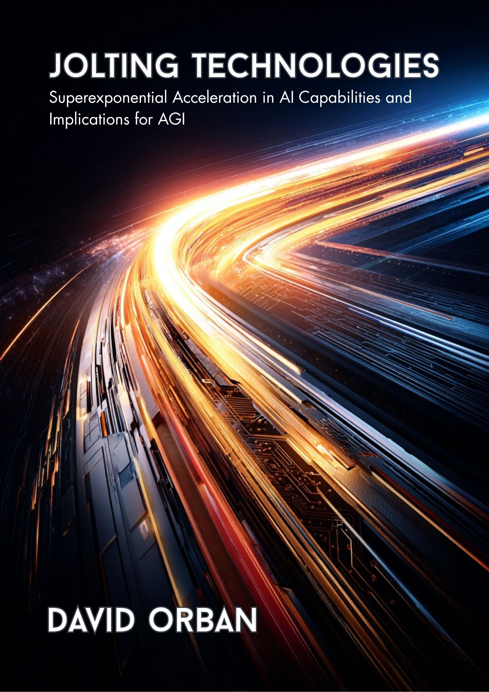

  
  
Click cover to download PDF

# Welcome to Jolting Technologies

The Jolting Technologies Hypothesis explores the nature of technological acceleration, governance challenges, and the potential for discontinuous jumps in capability growth.

## What is Jolting?

Jolting refers to sudden, super-exponential accelerations in technological progress that challenge existing governance frameworks and societal adaptation mechanisms.

## Explore Our Research

- [About the Hypothesis](about.md)
- [Research & Code](research.md)
- [Simulations](simulations.md)
- [Blog](blog.md)
- [Download PDF](jolting-technologies-david-orban.pdf)

## Latest Updates


- [{{ post.title }}]({{ post.url }}) - {{ post.date | date: "%B %d, %Y" }}


---

*This site is under progressive development. Contributions welcome!*
